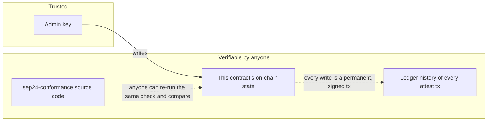
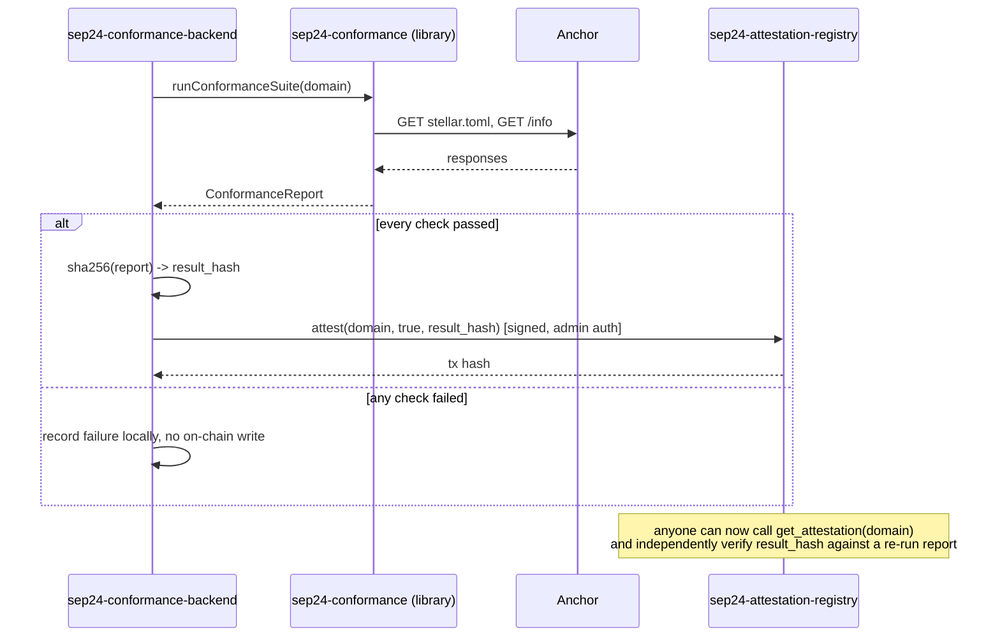

# sep24-attestation-registry

A minimal Soroban smart contract that stores on-chain attestations of
[SEP-24](https://github.com/stellar/stellar-protocol/blob/master/ecosystem/sep-0024.md)
conformance checks — a durable, publicly queryable answer to "is this
anchor currently verified?" that doesn't depend on trusting whoever runs
the checker.

Part of a three-repo project:

- [`sep24-conformance`](https://github.com/SEP-24-conform/sep24-conformance) — the checking library + CLI. Produces the results this contract stores.
- **This repo** — the on-chain record.
- [`sep24-conformance-backend`](https://github.com/SEP-24-conform/sep24-conformance-backend) — the API service that runs the checker and writes to this contract.

## Table of contents

- [Why this exists](#why-this-exists)
- [Trust model](#trust-model)
- [Data model](#data-model)
- [Interface reference](#interface-reference)
- [Sequence: from check to on-chain record](#sequence-from-check-to-on-chain-record)
- [Deployed instances](#deployed-instances)
- [Storage and TTL considerations](#storage-and-ttl-considerations)
- [Security considerations](#security-considerations)
- [Testing philosophy](#testing-philosophy)
- [Development](#development)
- [Deploying your own instance](#deploying-your-own-instance)
- [Design decisions](#design-decisions)
- [What this deliberately does not do](#what-this-deliberately-does-not-do)
- [FAQ](#faq)
- [Contributing](#contributing)
- [License](#license)

## Why this exists

[`sep24-conformance`](https://github.com/SEP-24-conform/sep24-conformance)
can tell you, right now, whether an anchor's `/info` endpoint matches the
SEP-24 spec. But that result only exists wherever you happened to run the
check — in a terminal, in a CI log, wherever. If a wallet, a directory
site, or another app wants to know "is this anchor currently verified?",
there's nothing to query. The options are: trust a centralized list
someone else maintains and hope it's kept current and honest, or re-run the
check yourself every time.

This contract gives that result a third option: a durable, on-chain,
independently queryable record. An off-chain backend runs the actual
conformance suite (see `sep24-conformance-backend`), and only if it
passes, submits a signed attestation here. Anyone can then read
`get_attestation(domain)` directly from the ledger.

## Trust model

Read carefully, because this is the part that actually matters for
deciding how much to rely on this contract.

This contract does **not** run any checks itself and has no opinion on
what "conformant" means. It is a signed, timestamped bulletin board with
exactly one poster. The trust model is:

- **Trust the admin key** to only submit attestations that reflect real
  conformance runs. The admin is a single Stellar account (currently held
  by `sep24-conformance-backend`).
- You do **not** need to trust the admin to *not lie in the future about
  past results* in the way you would with a centralized website — every
  write is a Stellar transaction, permanently visible in ledger history,
  signed by the admin key at the time it was submitted. The admin can
  overwrite what the *current* attestation for a domain says (see
  [Data model](#data-model)), but cannot rewrite the historical record of
  what it submitted and when.
- Because the checker (`sep24-conformance`) is open source, anyone can
  independently re-run the same check the admin claims to have run and
  compare results — the admin's claims are falsifiable, not just asserted.
- If the admin key were compromised, the attacker could write false
  attestations until `set_admin` is used to rotate to a new key. There is
  no multi-signature or governance layer over the admin role in this
  version — see [What this deliberately does not do](#what-this-deliberately-does-not-do).



## Data model

```rust
pub struct Attestation {
    pub timestamp: u64,       // ledger close time (unix seconds) when written
    pub passed: bool,         // whether the conformance run had zero failures
    pub result_hash: BytesN<32>,  // hash of the full report, e.g. SHA-256
}
```

Storage is a single map from domain (`String`) to its most recent
`Attestation`. Writing a new attestation for a domain **overwrites** the
previous one — this contract stores current status, not a history log. The
permanent history still exists in the ledger's transaction record (every
`attest` call is its own transaction), just not indexed by this contract's
read interface.

`result_hash` deliberately doesn't store the full report on-chain — Soroban
storage costs scale with size, and a full JSON report is unbounded and
not worth persisting on-chain. Instead it stores a hash, so anyone holding
(or re-fetching) the full report from the backend can verify it matches
what was attested, without trusting the backend's copy is unmodified.

## Interface reference

| Function | Auth required | Description |
|---|---|---|
| `initialize(admin: Address)` | — | One-time setup. Panics if already initialized. |
| `get_admin() -> Address` | — | Returns the current admin address. |
| `set_admin(new_admin: Address)` | current admin | Rotates the admin key. The only recovery path if the admin key needs to change. |
| `attest(domain: String, passed: bool, result_hash: BytesN<32>)` | admin | Records a conformance result for `domain`, overwriting any prior attestation for the same domain. |
| `get_attestation(domain: String) -> Option<Attestation>` | — | Reads the latest attestation for `domain`. `None` if never attested. |

## Sequence: from check to on-chain record



## Deployed instances

| Network | Contract ID |
|---|---|
| Testnet | [`CAPBMA52MFEJQYF7IJCD3EK4NJERKMICYKVRF7JBEIHZI65Y2HA5SUR3`](https://stellar.expert/explorer/testnet/contract/CAPBMA52MFEJQYF7IJCD3EK4NJERKMICYKVRF7JBEIHZI65Y2HA5SUR3) |
| Mainnet | not yet deployed |

## Storage and TTL considerations

Soroban ledger entries — including this contract's persistent storage —
are subject to a rent/TTL model: an entry that isn't extended can expire
and be archived off the live ledger, requiring an explicit restore
operation to read again. This contract uses `env.storage().persistent()`
for attestation records, which means **entries for domains that stop being
re-checked will eventually approach their TTL**.

This version does not automatically bump TTLs on read, and there's no
background job here that extends every stored attestation preemptively —
that responsibility currently sits with whoever operates the admin backend
(re-checking and re-attesting a domain naturally refreshes its entry's
TTL as a side effect of the write). A dedicated TTL-monitoring tool for
Soroban contracts more generally is a natural companion project; if one
exists under this same organization by the time you're reading this, it's
worth pointing at this contract's instance and persistent entries.

## Security considerations

- **Single admin key.** See [Trust model](#trust-model). This is the
  contract's main centralization point, by design — it keeps the contract
  itself small enough to audit in full, at the cost of putting trust in
  whoever holds that one key.
- **No re-entrancy or asset-custody surface.** This contract never holds,
  transfers, or has authority over any asset. It stores two primitive
  fields per domain. The blast radius of a bug here is "wrong attestation
  data," not "loss of funds."
- **`domain` is an unvalidated string.** The contract does not check that
  `domain` looks like a real hostname — that validation happens in
  `sep24-conformance-backend` before it ever calls `attest`. Anyone reading
  from this contract directly (bypassing the backend) should not assume
  `domain` keys are well-formed.
- **Admin rotation is a single transaction with no timelock.** If you fork
  this for a higher-stakes deployment, consider adding a timelock or
  multi-sig requirement on `set_admin` — this version deliberately doesn't,
  to keep the contract small (see [Design decisions](#design-decisions)).

## Testing philosophy

7 unit tests, all in `contracts/registry/src/test.rs`. The one worth
calling out specifically: `attest_fails_without_the_admins_authorization`.

Soroban's test harness offers `env.mock_all_auths()`, which makes every
`require_auth()` call in the contract succeed unconditionally — convenient
for testing storage logic, but it means a test suite that only ever calls
`mock_all_auths()` can reach 100% line coverage on `attest()` while never
actually proving the admin-only gate works. That test builds a fresh `Env`
with no blanket auth mock, so `attest`'s `admin.require_auth()` call has
nothing backing it and must panic — the only way to actually verify the
authorization check is load-bearing rather than dead code that happens to
never get exercised as "fail closed."

## Development

```sh
cargo test              # 7 unit tests, including the negative auth test above
stellar contract build   # -> target/wasm32v1-none/release/registry.wasm (~2.9KB)
```

## Deploying your own instance

```sh
# 1. Generate and fund an admin identity (testnet)
stellar keys generate registry-admin --network testnet --fund

# 2. Build and deploy
stellar contract build
stellar contract deploy \
  --wasm target/wasm32v1-none/release/registry.wasm \
  --source registry-admin --network testnet --alias registry

# 3. Initialize
stellar contract invoke --id registry --source registry-admin --network testnet -- \
  initialize --admin "$(stellar keys address registry-admin)"

# 4. (optional) Rotate admin to a different key, e.g. one held only by a backend service's .env
stellar contract invoke --id registry --source registry-admin --network testnet -- \
  set_admin --new_admin "<new admin public key>"
```

Step 4 is exactly how this project's own testnet instance is configured:
the deploying key is not the key that actually signs attestations day to
day — admin was rotated to a dedicated key generated for, and held only
by, `sep24-conformance-backend`.

## Design decisions

**Why Soroban and not just a regular database the backend controls?** A
database the backend controls is exactly the "trust a centralized list"
option this project exists to avoid. Putting the record on Stellar means
the write is a public, signed, timestamped transaction that anyone can
audit independently of the backend's cooperation — including after the
backend disappears.

**Why not store the full report on-chain instead of a hash?** Cost and
boundedness. A JSON report is arbitrary-sized and would make storage cost
scale with report verbosity for no real benefit — a hash is enough to
verify a specific report matches what was attested, at fixed, minimal cost.

**Why overwrite rather than append a history?** An append-only history
(a `Vec<Attestation>` per domain, say) is a reasonable extension but adds
unbounded storage growth per domain and complicates the read interface for
the common case (callers almost always want "is this currently verified,"
not "show me every historical check"). Kept out of v0 deliberately; see
[Contributing](#contributing) if this is worth adding.

**Why no multi-sig or DAO governance over the admin role?** Same reasoning
as the hash-not-full-report decision: every added feature is more attack
surface and more to audit in a contract whose main value proposition is
being small enough to read in full in a few minutes. See
[Security considerations](#security-considerations) for the trade-off this
implies.

## What this deliberately does not do

- Run conformance checks itself (that's `sep24-conformance`'s job).
- Store more than the latest attestation per domain.
- Provide any reputation, scoring, or ranking beyond a single pass/fail bit.
- Enforce anything about what a "domain" string looks like.
- Provide governance, multi-sig, or timelock protection over the admin role.

If any of these turn out to matter for a real use case, they belong in a
new version or a companion contract, not bolted onto this one — see
[Contributing](#contributing).

## FAQ

**What happens if the admin key is lost?** Nothing already-written is
lost — existing attestations remain readable forever via
`get_attestation`. But no *new* attestations can be written, since
`set_admin` itself requires the current admin's signature. There is
currently no recovery path for a fully lost admin key; this would require
a contract upgrade (Soroban supports upgradeable contracts via a separate
mechanism not used here) or redeploying and pointing consumers at a new
contract ID.

**Can anyone call `get_attestation`?** Yes — it requires no authentication
and costs only the standard Soroban simulation/read cost, not a full
signed transaction. See `sep24-conformance-backend`'s
`/api/registry/:domain/onchain` endpoint for a worked example of a
trustless read.

**Why is `passed` a plain boolean instead of, say, a score or a list of
which specific checks failed?** Deliberately minimal for v0 — see
[What this deliberately does not do](#what-this-deliberately-does-not-do).
The full per-check breakdown is available off-chain from whoever ran the
check (and independently reproducible via `sep24-conformance`); this
contract only needs to answer "verified or not" cheaply for on-chain
consumers like wallets that just need a boolean gate.

## Contributing

The extensions flagged above as deliberately out of scope — attestation
history, richer result data, admin governance — are the natural places to
contribute, each as a proposal (an issue describing the storage/cost
trade-off) before a PR, since each one changes the contract's audit
surface.

## License

Apache-2.0
